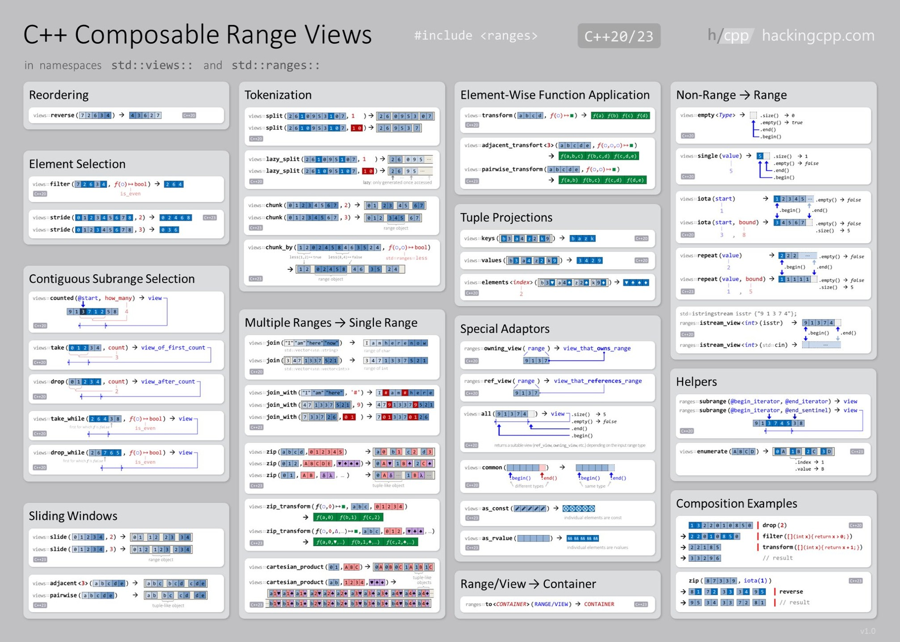

<!-- @format -->

# Ranges e Views

A biblioteca `<ranges>` do **C++20**/**C++23** é uma extensão das bibliotecas `<algorithm>` e `<iterator>`,
tornando o trabalho com sequências de dados mais simples, composable(componível) e seguro. Ela introduz o conceito de ranges,
que são abstrações de sequências iteráveis (como vetores, arrays ou outras coleções), e views, que são objetos leves
que representam transformações ou visualizações dessas sequências sem copiar os dados.

> **NOTA:** Composable(ou componível) é um termo que descreve algo que pode ser combinado facilmente com outras partes para  
> formar sistemas maiores, mantendo flexibilidade e modularidade. Ou seja, você consegue montar e reorganizar componentes  
> sem precisar reescrever código. Ou seja, você consegue montar e reorganizar componentes sem precisar reescrever código.

## Ranges

A biblioteca cria e manipula visualizações de intervalos, objetos leves que representam indiretamente sequências iteráveis (intervalos).
Com ranges, pode-se chamar `std::ranges::sort(myVector);`, que será tratado como se você tivesse chamado como
`std::sort(myVector.begin(), myVector.end());`, e isto pode ocorrer com quaisquer funções da **header `<algorithm>`**,
mudando além de facilitar o uso, possuindo alguns tipos de intervalos

- **[início, fim)** – Pares de iteradores. Exemplo: intervalos criados implicitamente a partir de contêineres.
  Todos os algoritmos que aceitam pares de iteradores agora têm sobrecargas que aceitam intervalos.
  - **EXE.: rangs::find(range, value)**
  - **std::ranges::sort(v);** **// v é um std::vector**

- **begin + [0, tamanho)** – – Sequências contadas. Exemplo: intervalo retornado por views::counted.
  - **auto r = std::views::counted(vec.begin(), 5);** **// primeiros 5 elementos**

- **[begin, pred(ou condição))** – Sequências terminadas condicionalmente. Exemplo: intervalo retornado por views::take_while.
  - **EXE.: rangs::find_if_not(range, bool)**
  - **auto r = vec | std::views::take_while([](int x){ return x < 10; });**

- **[begin, ..)** – Sequências ilimitadas. Exemplo: intervalo retornado por views::iota.
  - **auto first_five = r | std::views::take(5);** **// {1, 2, 3, 4, 5}**
  - **auto r = std::views::iota(1);** **// {1, 2, 3, ...}**
  - **auto r = std::views::iota(0);** **// sequência infinita de inteiros começando em 0**

---

## Views

Já uma **view** é um intervalo leve. As operações de visualização, como construção padrão, movimentação/atribuição, cópia,
construção/atribuição (se presente), destruição, início e fim, ocorrem em tempo constante, independentemente do número
de elementos na vista. As views são criadas por adaptadores de intervalo, que transformam ranges sem alterar os dados originais.

## Composables Views



---

## Consideração importante

Os componentes `ranges` e `views` pertencem às versões mais modernas do padrão **C++**,
introduzidos oficialmente a partir do **C++20** (com extensões e melhorias no **C++23**).

Por esse motivo, ao compilar o código **sem especificar explicitamente o padrão**, podem ocorrer
erros de compilação, já que muitos compiladores ainda utilizam padrões mais antigos como padrão (**C++14** ou **C++17**).

- Recomendação: Compile explicitamente informando o padrão desejado

```bash
g++ -std=c++20 arquivo.cpp
# ou
g++ -std=c++23 arquivo.cpp
```

Além disso, é importante garantir que o compilador utilizado (como `g++` ou `clang++`)
esteja em uma versão que **suporte completamente** `ranges` e `views`.
