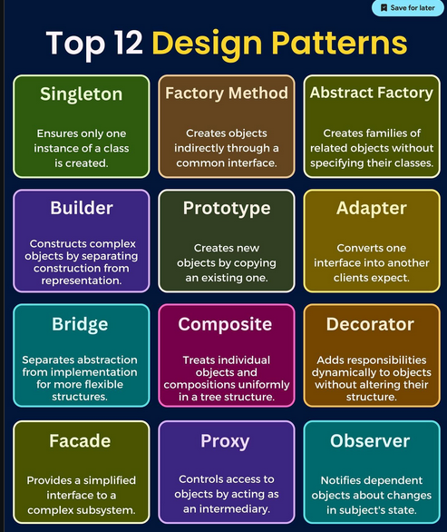
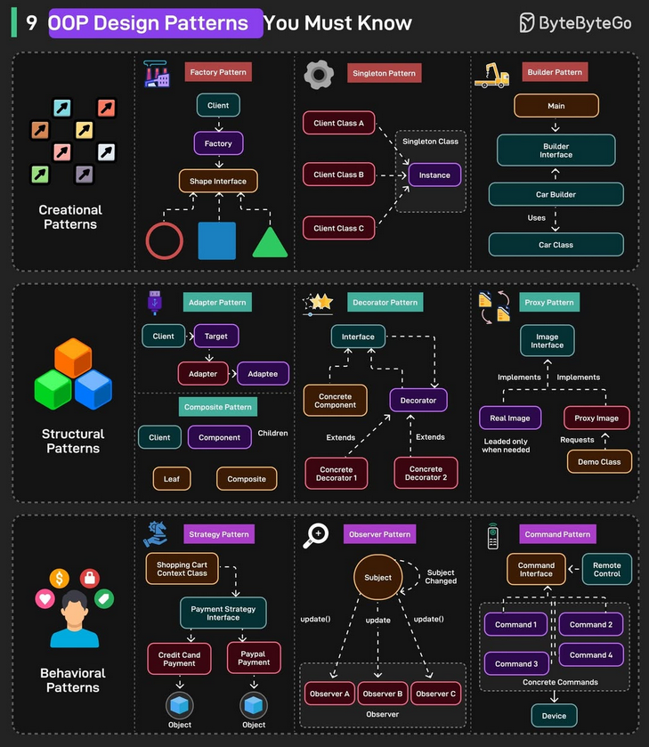

<!-- @format -->

# Design Patterns (Padrões de Projeto)

Design Patterns (`Padrões de Projetos`) são soluções reutilizáveis para problemas recorrentes no desenvolvimento de software.
Eles representam boas práticas consolidadas a partir da experiência de desenvolvedores ao longo do tempo.
Embora não sejam exclusivos da Programação Orientada a Objetos (POO), os Design Patterns se aplicam muito bem a
esse paradigma e são amplamente utilizados nesse contexto. Por isso, este tema é fundamental dentro da engenharia de software.

---

## Quando Utilizar

### Quando usar Design Patterns?

- Quando você identifica um problema recorrente que já possui um padrão bem definido.
- Para evitar soluções complexas e mal estruturadas.
- Para melhorar a comunicação entre desenvolvedores, utilizando um vocabulário comum.
- Em sistemas que precisam evoluir, escalar e se manter flexíveis ao longo do tempo.

### Quando não usar?

- Quando o problema é simples e não justifica a complexidade do padrão.
- Quando o padrão é aplicado apenas por modismo, sem necessidade real.
- Quando a aplicação do padrão torna o código menos legível para a equipe.

---

## Tipos de Design Patterns

Existem diversos tipos de Design Patterns, cada um com um objetivo específico e aplicações diferentes conforme o problema a ser resolvido.
De forma geral, eles podem ser classificados em categorias como:

- **Criacionais** – focados na criação de objetos
- **Estruturais** – lidam com a composição de classes e objetos
- **Comportamentais** – tratam da comunicação e responsabilidades entre objetos

> Alguns exemplos famosos de Design Pattern

> Alguns exemplo de design pattern para POO

