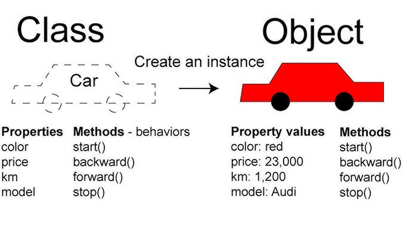
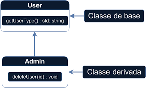
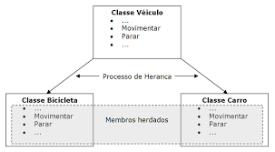
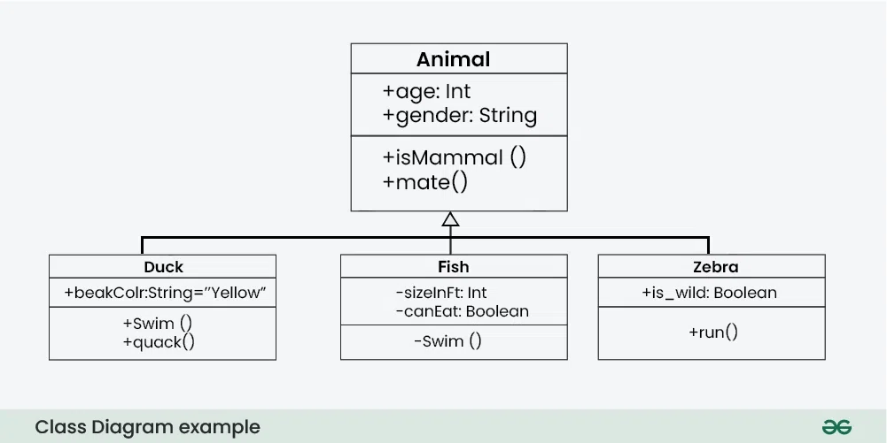

# PROGRAMAÇÃO ORIENTADA À OBJETOS(POO)

## Explicação Sobre POO

Programação Orientada a Objetos (POO) — do inglês Object-Oriented Programming (OOP) —
É um paradigma de programação baseado no conceito de objetos, que são instâncias de classes.

As classes funcionam como moldes que definem:

- `Atributos` (dados/variáveis)
- `Métodos` (comportamentos/funções)

Objetos são espaços de memória criados com base em suas respectivas classes,
possuindo estado (valores dos atributos) e comportamentos (métodos).

A construção de sistemas orientados a objetos geralmente segue a abordagem `bottom-up`
(de baixo para cima), iniciando pela definição de objetos e suas interações, para depois
estruturar o sistema como um todo. Esse paradigma promove a modularidade, reutilização
de código, facilidade de manutenção e maior organização no desenvolvimento de software.

Este paradigma promove:

- Modularidade (divisão do sistema em partes menores e independentes, facilitando o desenvolvimento
  e testes separados).

- Reutilização de código (uso de partes do código em diferentes programas ou módulos, economizando
  tempo e esforço).

- Facilidade de manutenção (mais simples corrigir erros ou atualizar o sistema, já que as partes
  são bem organizadas e separadas).

- Maior organização no desenvolvimento de software (estrutura clara do projeto, facilitando o
  trabalho em equipe e a compreensão do sistema).

- Escalabilidade (Estrutura flexível que facilita a adição de novas funcionalidadessem afetar
  o restante do sistema).

---

## Pilares da POO

1. **Abstração:**  
   Processo de simplificação no qual modelos são criados para representar entidades do mundo real.
   Em POO, isso é feito por **classes**, que funcionam como moldes para **objetos**, destacando apenas
   os **atributos e comportamentos relevantes** para o sistema, ignorando detalhes desnecessários.

   

2. **Encapsulamento:**  
   Mecanismo que **protege os dados internos** de um objeto, controlando o acesso
   por meio de métodos **públicos** `(getters e setters)`, garantindo integridade e segurança das informações.

   

3. **Herança:**  
   Permite que **classes compartilhem atributos e métodos comuns**, criando uma hierarquia
   e promovendo o **reuso de código**.

   

4. **Polimorfismo:**  
   Capacidade de **objetos diferentes responderem de forma distinta** à mesma mensagem (método),
   dependendo do **contexto** ou do tipo específico do objeto.

  

---

## Desvantagens da POO

- **Curva de aprendizado:**  
  Exige que o programador compreenda conceitos abstratos como encapsulamento, herança e polimorfismo.

- **Maior complexidade em projetos pequenos:**  
  Para sistemas simples, a estrutura orientada a objetos pode ser excessivamente elaborada.

- **Desempenho:**  
  Em alguns casos, a abstração pode introduzir sobrecarga de desempenho (por exemplo, uso de muitos objetos ou herança profunda).

- **Sobe o custo de design inicial:**  
  Planejar um sistema orientado a objetos exige mais tempo e cuidado na definição de classes e relações.

- **Abuso de herança:**  
  Quando mal utilizada, a herança pode gerar sistemas rígidos, difíceis de modificar e manter.

- **Dependência entre classes:**  
  Mal projetadas, as dependências podem tornar o sistema altamente acoplado.

---

## POO em C++: Vantagens e Desvantagens

| **Vantagens**                                          | **Desvantagens**                            |
| ------------------------------------------------------ | ------------------------------------------- |
| Linguagem poderosa e de alto desempenho                | Sintaxe pode ser complexa                   |
| Suporte completo à Programação Orientada a Objetos     | Requer compilação e ferramentas específicas |
| Controle detalhado sobre recursos                      | Manipulação direta de ponteiros             |
| Flexível no gerenciamento de hardware                  | Gerenciamento manual de memória             |
| Grande comunidade e documentação rica                  | Propenso a erros como _memory leaks_        |
| Suporte a múltiplos paradigmas (estruturado, genérico) | Curva de aprendizado acentuada              |

---

## Diagramas em POO

Diagramas representam graficamente os conceitos das classes, atributos e métodos.
No estilo UML (Unified Modeling Language):

- Atributos são representados com o prefixo `-` (privado).
- Métodos com o prefixo `+` (público).
- Protegidos usam `#`.
- O nome da classe aparece no topo da caixa.
- Atributos no meio.
- Métodos na parte inferior.

### Ferramentas para criar diagramas UML online

- [Visual Paradigm Online](https://online.visual-paradigm.com/)
- [Draw.io (diagrams.net)](https://app.diagrams.net/)
- [PlantUML](https://plantuml.com/) – gera diagramas a partir de código de texto
- [StarUML](https://staruml.io/)

### Sites com exemplos visuais

- [Go UML Tutorial](https://www.go-uml.com/class-diagram-tutorial-a-comprehensive-guide/)
- [Creately UML Guide](https://creately.com/blog/software-teams/class-diagram-tutorial/)
