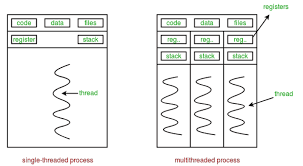
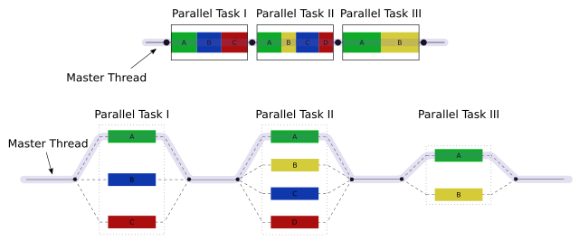
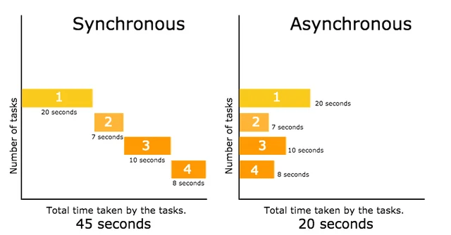

# Multithreading E Concurrency

**Multithreading e Concorrência (ou simultaneidade)**: São conceitos fundamentais na
programação moderna, utilizados para melhorar a eficiência e o desempenho dos softwares,
pois, conforme à medida que a complexidade dos programas aumenta, cresce também a demanda
por recursos de hardware como memória, armazenamento e poder de processamento.
Técnicas como essas são essenciais para construir sistemas escaláveis e responsivos.

---

## O que é Multithreading?

**Multithreading**: É uma técnica onde um único processo pode executar várias threads (linhas de execução)
de forma concorrente. Isso permite que diferentes partes de um programa rodem "ao mesmo tempo",
compartilhando o mesmo espaço de memória. Embora uma CPU com apenas um núcleo não execute threads
simultaneamente, ela pode alternar rapidamente entre elas (context switching), dando a impressão
de simultaneidade.

Em sistemas com múltiplos núcleos (multi-core), as threads podem de fato ser executadas em paralelo.

---

## Simultaneidade vs Paralelismo

É comum confundir os termos simultaneidade e paralelismo, mas eles têm significados distintos:

**Simultaneidade (Concorrência)**: Capacidade de lidar com várias tarefas ao mesmo tempo.
Essas tarefas podem não estar sendo executadas exatamente no mesmo instante, mas são
gerenciadas de forma que compartilhem eficientemente os recursos da CPU.

**Paralelismo**: Execução real de várias tarefas ao mesmo tempo, geralmente em processadores
diferentes (núcleos distintos). É uma forma específica e mais restrita de simultaneidade.

---

## Sincronização vs Assíncrono

**Síncrono**: Em operações síncronas, tudo acontece de forma sequencial. Ou seja, uma tarefa
deve ser completada antes que a próxima comece. O processo de execução é bloqueante, o que
significa que o sistema aguarda a conclusão de uma operação antes de seguir para a próxima.

**Assíncrono**: Operações assíncronas, as tarefas podem ser iniciadas e o sistema pode
continuar executando outras tarefas enquanto aguarda a conclusão da primeira. Ou seja,
as operações não bloqueiam a execução das demais. Isso é muito útil quando se está lidando
com tarefas que podem demorar, como leitura de arquivos, requisições de rede ou chamadas a banco
de dados.

---

## Funções e Usos de Cada Header

Assim como em C, trabalha com este meio de programação através de thread, mutex, semaphores,
onde em C temos as bibliotecas `<pthreads.h>`, `<semaphore.h>`, `<atomic.h>`.

| **C** Header    | **Função/Propósito**                               |
| --------------- | -------------------------------------------------- |
| `<pthread.h>`   | Gerenciamento de threads.                          |
| `<semaphore.h>` | Controle de acesso a recursos com semáforos.       |
| `<atomic.h>`    | Operações atômicas para acesso seguro a variáveis. |

Em C++ temos.

| **C++** Header         | **Função/Propósito**                                                         |
| ---------------------- | ---------------------------------------------------------------------------- |
| `<thread>`             | Criar e gerenciar threads.                                                   |
| `<coroutines>`         | Suporte a corrotinas para programação assíncrona e concorrente.              |
| `<future>`             | Gerenciar valores retornados de tarefas assíncronas e thread-safe.           |
| `<condition_variable>` | Sincronização entre threads com base em uma condição.                        |
| `<semaphore>`          | Controle de acesso a recursos compartilhados, limitando o número de threads. |
| `<atomic>`             | Operações atômicas para garantir acesso seguro a dados compartilhados.       |

---

## O Que É Possível Fazer Com A Programação Concorrete

A programação concorrente oferece um vasto leque de possibilidades para otimizar sistemas
e melhorar a performance, principalmente em cenários onde múltiplas tarefas precisam ser
executadas simultaneamente ou onde o tempo de resposta é crítico.
Abaixo estão algumas áreas e exemplos de aplicação da concorrência:

- Servidores Web e Redes

**Desafio**: Processar múltiplas requisições simultaneamente.

**Como a concorrência ajuda**: Em vez de esperar uma requisição ser totalmente processada
antes de começar a próxima, o servidor pode delegar o processamento de várias requisições
ao mesmo tempo (usando múltiplas threads ou processos). Isso melhora drasticamente a eficiência
e o tempo de resposta.

**Exemplo**: Servidores como Apache e Nginx usam técnicas de multithreading para lidar com milhares de conexões simultâneas.

---

- Sistemas de Banco de Dados

**Desafio**: Processar múltiplas transações de forma simultânea, garantindo integridade e consistência dos dados.

**Como a concorrência ajuda**: Threads podem ser alocadas para processar diferentes transações
ao mesmo tempo. No entanto, é necessário usar locks ou semáforos para garantir que os dados
não sejam corrompidos por acessos simultâneos.

**Exemplo**: Sistemas de gerenciamento de banco de dados (SGBD), como MySQL e PostgreSQL,
utilizam concorrência para processar múltiplas consultas simultaneamente, enquanto implementam
mecanismos de isolamento transacional para garantir a integridade dos dados.

---

- Processamento de Dados em Lote

**Desafio**: Processar grandes volumes de dados em tempo hábil.

**Como a concorrência ajuda**: Ao dividir o trabalho em múltiplas threads
ou processos, o processamento pode ser feito em paralelo, aumentando a eficiência.

**Exemplo**: MapReduce (utilizado no Hadoop e no Spark) divide grandes tarefas de
processamento de dados em várias partes menores que podem ser executadas simultaneamente
em diferentes nós, aumentando a velocidade e escalabilidade.

---

- Jogos e Simulações em Tempo Real

**Desafio**: Atualizar gráficos, responder a entradas do usuário, e processar a lógica do jogo
ao mesmo tempo, mantendo a fluidez da aplicação.

**Como a concorrência ajuda**: O jogo pode usar threads para atualizar a interface gráfica,
processar as entradas do usuário e rodar a lógica do jogo simultaneamente. O uso de threads
específicas para gráficos, física e IA melhora a performance geral.

**Exemplo**: Em jogos 3D ou simuladores como Unity e Unreal Engine, diferentes partes do jogo
(renderização, física, rede, etc.) podem ser executadas em threads separadas para garantir
uma experiência de usuário mais fluida.

---

- Interface Gráfica de Usuário (GUI)

**Desafio**: Manter a interface gráfica responsiva enquanto processa tarefas de fundo
(ex. carregamento de arquivos, cálculos pesados, downloads).

**Como a concorrência ajuda**: Usar threads para executar tarefas de longa duração em
segundo plano, enquanto a thread principal permanece livre para lidar com interações
com o usuário. Isso evita que a aplicação "congele" durante a execução de tarefas demoradas.

**Exemplo**: Em aplicações desktop (como `Qt` e `GTK`), é comum usar threads de fundo
para realizar tarefas como salvar arquivos, sem bloquear a interface do usuário.

---

- Aplicações de IA e Machine Learning

**Desafio**: Treinar modelos de IA, que muitas vezes exigem grandes quantidades de dados e cálculos pesados.

**Como a concorrência ajuda**: Técnicas de paralelismo e multithreading são aplicadas para
dividir o processo de treinamento em várias partes, processando diferentes porções de dados
ao mesmo tempo. Além disso, frameworks como TensorFlow e PyTorch utilizam múltiplos núcleos
de CPU ou até GPUs para acelerar o treinamento de modelos.

**Exemplo**: Redes neurais podem ser treinadas de maneira muito mais rápida utilizando concorrência,
já que o processo de ajuste de pesos pode ser distribuído por diferentes núcleos de CPU ou máquinas.

---

- Sistemas de Monitoramento e Automação

**Desafio**: Monitorar e reagir a eventos em tempo real.

**Como a concorrência ajuda**: Threads podem ser usadas para monitorar diferentes fontes
de dados, como sensores ou sistemas externos, ao mesmo tempo, e realizar ações conforme
necessário (como enviar alertas, acionar sistemas de segurança, etc.).

**Exemplo**: Sistemas de automação industrial e smart homes utilizam programação
concorrente para gerenciar e controlar dispositivos e sensores em tempo real.

---

Embora a programação concorrente ofereça grandes vantagens, ela também traz alguns **desafios** significativos:

- Condições de Corrida (Race Conditions)

**Problema**: Quando duas ou mais threads tentam acessar ou modificar o mesmo dado
simultaneamente, sem controle adequado, pode ocorrer corrupção de dados.

**Solução**: O uso de mutexes, semaforos e variáveis atômicas ajuda a garantir que
apenas uma thread acesse um recurso compartilhado por vez.

---

- Deadlocks

**Problema**: Quando duas ou mais threads ficam bloqueadas esperando umas pelas outras, resultando em um impasse.

**Solução**: O uso de técnicas como ordenação de bloqueios ou timeouts pode prevenir deadlocks.

---

- Sincronização Complexa

**Problema**: Em sistemas mais complexos, coordenar a execução de várias threads pode se
tornar difícil, especialmente quando é necessário garantir que certas tarefas sejam
executadas na ordem correta.

**Solução**: Técnicas como condições de variável, barreiras e futuro/promessa são
comumente usadas para coordenar tarefas de forma eficiente.
